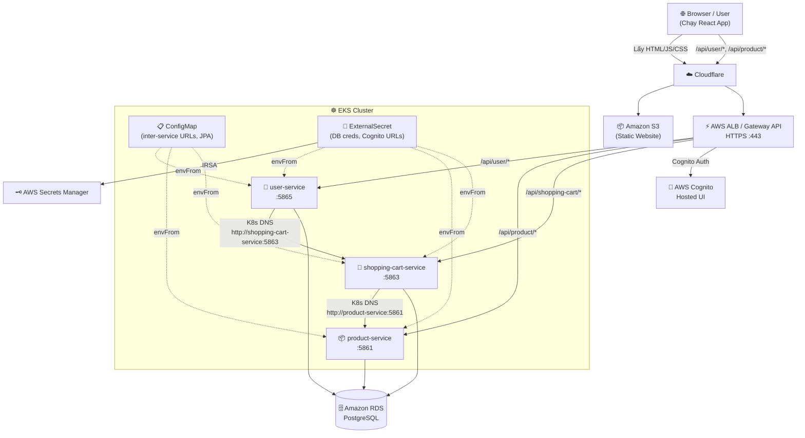

# 🛒 Ecom Shop — Kiến Trúc Service & Sơ Đồ Kết Nối

## 📐 Tổng Quan Kiến Trúc

Hệ thống theo mô hình **Cloud-Native Microservices**.
Frontend được host riêng rẽ trên **Amazon S3** (Static Hosting) thông qua CDN (Cloudflare).
Backend chạy trên **AWS EKS** sử dụng **Gateway API**.

```text
🌐 User (Browser)
        ↓
+--------------------------------------+
| CDN / Edge                           |
| (Cloudflare)                         |
+--------------------------------------+
        ↓ (1. Tải ứng dụng FE)
+--------------------------------------+
| Static Host                          |
| (Amazon S3 - React build)            |
+--------------------------------------+
        ↓
(load HTML / JS / CSS)
        ↓
Browser chạy FE app (React)
        ↓ (2. Gọi API HTTPS request)
+--------------------------------------+
| Cloudflare (proxy tiếp)              |
+--------------------------------------+
        ↓
+--------------------------------------+
| Load Balancer                        |
| (AWS ALB - Application Load Balancer)|
+--------------------------------------+
        ↓
+--------------------------------------+
| Gateway API (K8s EKS)                |
+--------------------------------------+
        ↓
[ HTTPRoute: /api/user, /api/product... ]
        ↓
[ Service (ClusterIP) ]
        ↓
[ Backend Pods: user, product, cart ]
```

---

## 🧩 Danh Sách Services

| Service | Host/Cổng | Công nghệ | Nơi Deploy | Database |
|---|---|---|---|---|
| **frontend** | S3 Endpoint | React SPA | Amazon S3 | — |
| **product-service** | 5861 | Spring Boot 3 + JPA | EKS Pod | RDS PostgreSQL |
| **shopping-cart-service** | 5863 | Spring Boot 3 + JPA | EKS Pod | RDS PostgreSQL |
| **user-service** | 5865 | Spring Boot 3 + JPA | EKS Pod | RDS PostgreSQL |
| **Amazon RDS** | 5432 | PostgreSQL 16 | Private Subnet | — |
| **AWS Cognito** | External | Cognito Hosted UI | AWS | — |

---

## 🔄 Sơ Đồ Giao Tiếp Chi Tiết



---

## 📡 API Endpoints Chi Tiết

(Các endpoints của `user-service`, `product-service`, `shopping-cart-service` không thay đổi).

Frontend gọi backend thông qua absolute URL chỉ định qua biến môi trường (ví dụ `REACT_APP_BASE_API_URL=https://api.shop.dohoangdevops.io.vn/api/`).

---

## 🔗 Giao Tiếp Service-to-Service (Nội Bộ — K8s DNS)

Các backend giao tiếp nội bộ trong cụm EKS bằng K8s DNS (VD: `http://shopping-cart-service:5863`).

---

## ⚙️ Cấu Hình

Cấu hình cho K8s Backend giống như cũ (dùng ConfigMap và Secrets Manager). Frontend cấu hình bằng biến môi trường tại build time (trong `ecom-frontend/.env.production`).

---

## 🧰 Stack Công Nghệ

| Layer | Công nghệ |
|---|---|
| **Frontend** | React 18, Redux, React Router |
| **Frontend Serving** | Amazon S3 (Static Website Hosting) |
| **Backend** | Spring Boot 3.1.7, Java 17, Spring Data JPA |
| **Database** | Amazon RDS PostgreSQL 16 |
| **Auth** | AWS Cognito Hosted UI (Gateway integration) |
| **Service Discovery** | Kubernetes CoreDNS (EKS addon) |
| **Config** | K8s ConfigMap + AWS Secrets Manager |
| **Container Registry** | Amazon ECR (Backend repos) |
| **Orchestration** | Amazon EKS (Kubernetes) |
| **Traffic Routing** | Kubernetes Gateway API |
| **DNS/CDN** | Cloudflare |
| **IaC** | Terraform |
