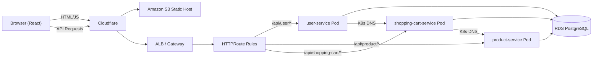

# SYSTEM

## 1. TONG QUAN HE THONG

Tai lieu nay mo ta kien truc cua he thong ecom-shop tren AWS EKS (cloud-native):

- **Khong dung** `api-gateway` trong codebase.
- **Khong dung** `discovery-server` (Eureka) — thay bang **Kubernetes DNS (CoreDNS)**.
- **Khong dung** `config-server` (Spring Cloud Config) — thay bang **Kubernetes ConfigMap** (non-sensitive) + **AWS Secrets Manager** (sensitive).
- **Khong dung** `keycloak` + `keycloak-mysql` — thay bang **AWS Cognito**.
- Su dung `Kubernetes Gateway API` (`GatewayClass` / `Gateway` / `HTTPRoute`) de route traffic.
- Su dung `Cognito` (OIDC) cho auth o lop edge (ALB/Gateway).
- Trien khai bang `ArgoCD` theo GitOps, image luu tren `ECR`.
- Su dung `IRSA` + `External Secrets Operator` de cap secrets vao Kubernetes.

Phan ung dung chinh:

- `ecom-frontend` (React SPA — S3 Static Hosting)
- `user-service` (Spring Boot 3)
- `product-service` (Spring Boot 3)
- `shopping-cart-service` (Spring Boot 3)

## 2. KIEN TRUC MICROSERVICES TREN AWS

### 2.1 So do tong the

```text
INTERNET --> Cloudflare (CDN) --> S3 (React Static Hosting)
                   |
                   | API requests
                   v
              AWS ALB (public subnet, internet-facing)
                   |
     ┌─────────────┴──────────────┐
     │      Gateway API           │
     │ GatewayClass / Gateway / HTTPRoute │
     │                            │
     │ /api/user/*      → user    │
     │ /api/product/*   → product │
     │ /api/shopping-*  → cart    │
     └─────────────┬──────────────┘
                   |
     ┌─────────────┴─────────────────────────────────┐
     │         EKS Cluster (private subnet)          │
     │ user-service     ──────────────────────────► RDS
     │ product-service  ──────────────────────────► RDS
     │ shopping-cart-service  ────────────────────► RDS
     │      │ K8s DNS → product-service:5861         │
     └───────────────────────────────────────────────┘

ECR repos: user-service | product-service | shopping-cart-service
Secrets Manager: /ecom/{env}/{service}/db, /ecom/{env}/user-service/cognito
Cognito User Pool: edge auth via Gateway
ArgoCD: GitOps pull from GitHub → sync to EKS
```

### 2.2 So do luong request chi tiet



Request flow chi tiet:

[User Browser (chay React app)]
    |
    | 1) HTTPS request (GET/POST /api/*)
    v
[Cloudflare DNS / CDN]
    |
    | 2) DNS resolve → Gateway endpoint
    v
[Gateway (HTTPS :443)]
    |
    | 3) Check authentication session/token
    |    - Chua auth → redirect Cognito Hosted UI
    v
[Amazon Cognito Hosted UI]
    |
    | 4) User login thanh cong → return token/session
    v
[Gateway + HTTPRoute Rules]
    |
    | 5) Route theo path:
    |    /api/user/*           → user-service (ClusterIP :5865)
    |    /api/product/*        → product-service (ClusterIP :5861)
    |    /api/shopping-cart/*  → shopping-cart-service (ClusterIP :5863)
    v
[Service Pod trong EKS private subnet]
    |
    | 6) Xu ly business logic
    |    Goi service khac qua Kubernetes DNS (http://service-name:port)
    v
[Amazon RDS PostgreSQL - private subnet]
    |
    | 7) Query/Update data
    v
[Response] → Gateway → Cloudflare → User Browser
```

### 2.3 Cau hinh va Secrets — Thay the Config Server

#### Non-sensitive config: Kubernetes ConfigMap

Helm chart tao ConfigMap tu `configMap` section trong values:

```yaml
# values/dev.yaml (vi du)
services:
  shopping-cart-service:
    configMap:
      PRODUCT_SERVICE_URL: http://product-service:5861
      JPA_SHOW_SQL: "true"
  user-service:
    configMap:
      SHOPPING_CART_SERVICE_URL: http://shopping-cart-service:5863
      JPA_SHOW_SQL: "true"
```

#### Sensitive config: AWS Secrets Manager + External Secrets Operator

```text
[Service Pod trong EKS]
    |
    | 1) ExternalSecret resource tham chieu secret trong Secrets Manager
    v
[External Secrets Operator]
    |
    | 2) Assume IAM role qua IRSA (service account → IAM role)
    v
[AWS Secrets Manager]
    |
    | 3) IAM policy check + tra secret value
    v
[Kubernetes Secret] (auto-created by ESO)
    |
    | 4) Inject vao pod qua envFrom secretRef
    v
[App Runtime] — doc SPRING_DATASOURCE_URL, SPRING_DATASOURCE_PASSWORD, v.v.
```

### 2.4 Service Discovery — Thay the Eureka

| Truoc (On-Premise) | Sau (Cloud-Native) |
|---|---|
| Eureka Server (port 8761) | **Kubernetes CoreDNS** (EKS addon) |
| `@LoadBalanced` RestTemplate | Plain `RestTemplate` + env var URL |
| `http://PRODUCT-SERVICE/api/...` | `http://product-service:5861/api/...` |
| `http://SHOPPING-CART-SERVICE/api/...` | `http://shopping-cart-service:5863/api/...` |
| `spring-cloud-starter-netflix-eureka-client` | **Removed** |
| `spring-cloud-starter-config` | **Removed** |
| `spring-cloud-starter-bootstrap` | **Removed** |

Kubernetes Service (ClusterIP) tu dong dang ky DNS record:
- `product-service.default.svc.cluster.local` (hoac `product-service:5861`)
- `shopping-cart-service.default.svc.cluster.local`
- `user-service.default.svc.cluster.local`

### 2.5 Lien ket giua cac service

- `shopping-cart-service` goi `product-service` qua K8s DNS de lay gia moi nhat khi tinh tong tien gio hang.
- `user-service` goi `shopping-cart-service` qua K8s DNS de tim/xoa gio hang theo user.
- Tat ca services doc/ghi du lieu tren Amazon RDS PostgreSQL.
- Cac service **khong con phu thuoc** `config-server`, `api-gateway`, `discovery-server`.
- Secrets lay tu **AWS Secrets Manager** thong qua IRSA + External Secrets Operator.
- Non-sensitive config lay tu **Kubernetes ConfigMap**.

### 2.6 Vi tri dat RDS trong mang

- RDS nam trong private subnets (khong public IP), toi thieu 2 AZ.
- RDS nam trong DB subnet group rieng (gom cac private subnets).
- ALB/Gateway nam o public subnets; EKS worker nodes va RDS nam o private subnets.
- Service trong EKS ket noi RDS qua private route + Security Group (port 5432).
- Khong mo inbound RDS ra Internet.

### 2.7 Cac thanh phan DA LOAI BO

| Component | Ly do loai bo | Thay the bang |
|---|---|---|
| `config-server` | On-premise, single point of failure | K8s ConfigMap + Secrets Manager |
| `discovery-server` (Eureka) | Khong can thiet tren K8s | Kubernetes CoreDNS |
| `api-gateway` | Thay bang Gateway API | AWS ALB + GatewayClass/Gateway/HTTPRoute |
| `keycloak` + `keycloak-mysql` | Self-hosted auth | AWS Cognito |
| `@LoadBalanced` | Eureka dependency | Plain RestTemplate + env var |
| `@EnableFeignClients` | Khong su dung | Da xoa |
| `spring-cloud-*` dependencies | Khong can nua | spring-boot-starter-actuator |

### 2.8 Mapping secret (AWS Secrets Manager)

Quy uoc ten secret (dung environment `{env}`):

- `/ecom/{env}/shared/rds` → `host`, `port`, `database`
- `/ecom/{env}/user-service/db` → `username`, `password`, `jdbc_url`
- `/ecom/{env}/product-service/db` → `username`, `password`, `jdbc_url`
- `/ecom/{env}/shopping-cart-service/db` → `username`, `password`, `jdbc_url`
- `/ecom/{env}/user-service/cognito` → `hosted_ui_login_url`, `hosted_ui_signup_url`

IRSA mapping:

- `sa-user-service` → read `/ecom/{env}/user-service/*` va `/ecom/{env}/shared/*`
- `sa-product-service` → read `/ecom/{env}/product-service/*` va `/ecom/{env}/shared/*`
- `sa-shopping-cart-service` → read `/ecom/{env}/shopping-cart-service/*` va `/ecom/{env}/shared/*`

### 2.9 Terraform Modules

| Module | Chuc nang |
|---|---|
| `vpc` | VPC, public/private subnets, NAT Gateway, VPC endpoints |
| `eks` | EKS cluster, node group, OIDC provider, CoreDNS/VPC CNI/kube-proxy addons |
| `rds` | RDS PostgreSQL, DB subnet group, security group |
| `alb_controller` | AWS Load Balancer Controller (Helm) |
| `external_dns` | External DNS (Cloudflare integration) |
| `argocd` | ArgoCD (GitOps CD) |
| `cognito` | Cognito User Pool + App Client |
| `secrets` | AWS Secrets Manager entries |
| `irsa` | IAM Roles for Service Accounts |
| `ecr` | Elastic Container Registry |
