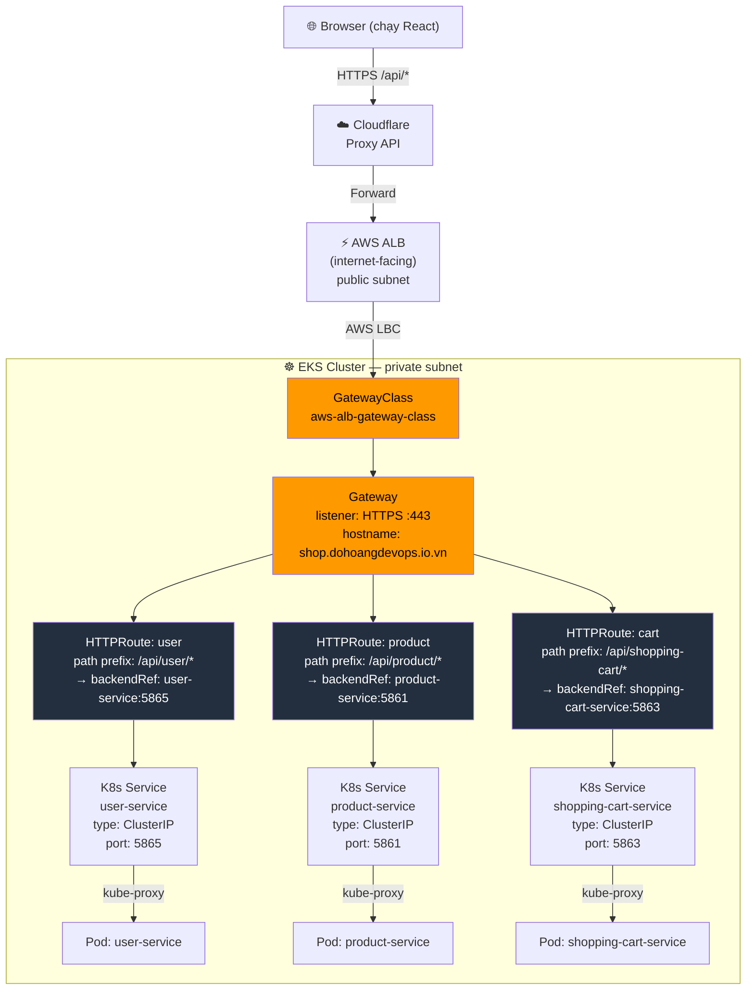

# 🌐 Traffic Flow — Ecom Shop trên EKS & S3

---

## 1. Tổng thể: Từ Internet vào Hệ thống

```
┌─────────────────────────────────────────────────────────────────────────────────┐
│  INTERNET                                                                        │
│                                                                                  │
│   Browser  ──HTTPS──►  Cloudflare (CDN / Edge)                                   │
└─────────────────────────────────────────────────────────────────────────────────┘
                                │ (1) Load tĩnh        │ (2) Gọi API
                                ▼                      ▼
                    ┌──────────────────┐    ┌──────────────────────────────────────┐
                    │  Amazon S3       │    │  AWS ALB                             │
                    │  (Static Host)   │    │  (internet-facing, public subnet)    │
                    │  React Build     │    └──────────────────────────────────────┘
                    └──────────────────┘                       │
                                                               │
                               ┌───────────────▼───────────────┴───────────────────────────────────┐
                               │  KUBERNETES CLUSTER (EKS — private subnet)                         │
                               │                                                                     │
                               │  ┌─── Gateway API Stack ─────────────────────────────────────────┐  │
                               │  │                                                                 │  │
                               │  │  GatewayClass (aws-alb-gateway-class)                        │  │
                               │  │       │                                                       │  │
                               │  │       ▼                                                       │  │
                               │  │  Gateway (HTTPS :443)                                        │  │
                               │  │       │                                                       │  │
                               │  │       ├──► HTTPRoute (user)     path: /api/user/*             │  │
                               │  │       ├──► HTTPRoute (product)  path: /api/product/*          │  │
                               │  │       └──► HTTPRoute (cart)     path: /api/shopping-cart/*    │  │
                               │  │                                                                 │  │
                               │  └─────────────────────────────────────────────────────────────────┘  │
                               │          │                  │                   │                    │
                               │          ▼                  ▼                   ▼                    │
                               │  ┌──────────────┐  ┌──────────────┐  ┌──────────────────────┐      │
                               │  │K8s Service   │  │K8s Service   │  │K8s Service           │      │
                               │  │user-service  │  │product-svc   │  │shopping-cart-svc      │      │
                               │  │ClusterIP:5865│  │ClusterIP:5861│  │ClusterIP:5863         │      │
                               │  └──────┬───────┘  └──────┬───────┘  └──────────┬────────────┘      │
                               │         │ kube-proxy        │ kube-proxy          │ kube-proxy        │
                               │         ▼                   ▼                     ▼                   │
                               │  ┌──────────────┐  ┌──────────────┐  ┌─────────────────────┐       │
                               │  │  Pod(s)      │  │  Pod(s)      │  │  Pod(s)             │       │
                               │  │  user-svc    │  │  product-svc │  │  shopping-cart-svc  │       │
                               │  └──────┬───────┘  └──────┬───────┘  └──────────┬──────────┘       │
                               │         │                   │                     │                   │
                               │         └───────────────────┴─────────────────────┘                   │
                               │                             │                                          │
                               │                             ▼                                          │
                               │                    ┌────────────────┐                                 │
                               │                    │  Amazon RDS    │                                 │
                               │                    │  PostgreSQL    │                                 │
                               │                    │  :5432         │                                 │
                               │                    └────────────────┘                                 │
                               └───────────────────────────────────────────────────────────────────────┘
```

---

## 2. Chi tiết: Gateway API routing (Backend)



---

## 3. Service-to-Service giao tiếp (nội bộ qua CoreDNS)

(Không đổi so với kiến trúc trước, sử dụng `http://service-name:port` qua K8s CoreDNS)

---

## 4. Cơ chế Service Discovery qua CoreDNS

(Không đổi, sử dụng CoreDNS trong Cluster EKS)

---

## 5. Secret injection — Trước khi Pod khởi động

(Không đổi, External Secrets Operator kéo credentials từ AWS Secrets Manager thông qua IRSA)

---

## 6. Tóm tắt các lớp mạng

| Lớp | Resource K8s | IP Type | Ai dùng |
|---|---|---|---|
| **Internet → S3** | N/A | Public IP | Browser lấy static files (HTML/JS/CSS) |
| **Internet → ALB** | AWS ALB | Public IP | Browser gọi REST API → Gateway |
| **ALB → Pod** | Gateway + HTTPRoute | Trực tiếp Pod IP | ALB gọi thẳng Pod |
| **Pod → Pod** | K8s Service + CoreDNS | Cluster-internal IP | service-to-service calls |
| **Pod → RDS** | DNS endpoint RDS | Private VPC IP | JPA/JDBC connection |
| **Pod → Secrets Manager**| ExternalSecret + IRSA | AWS API | External Secrets Operator |
